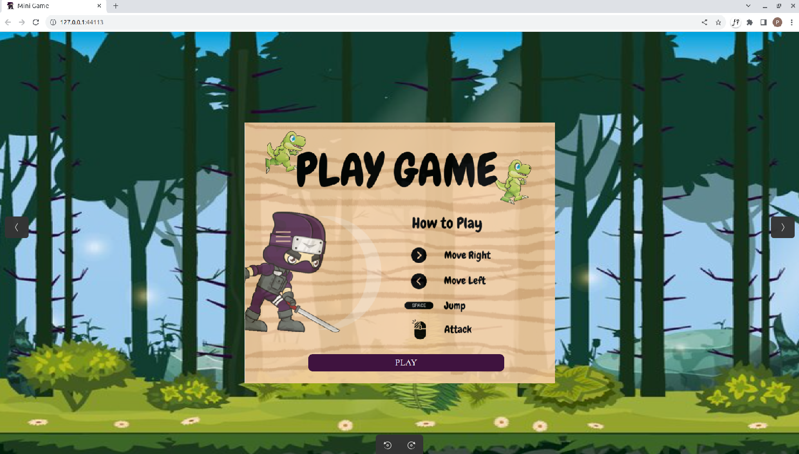
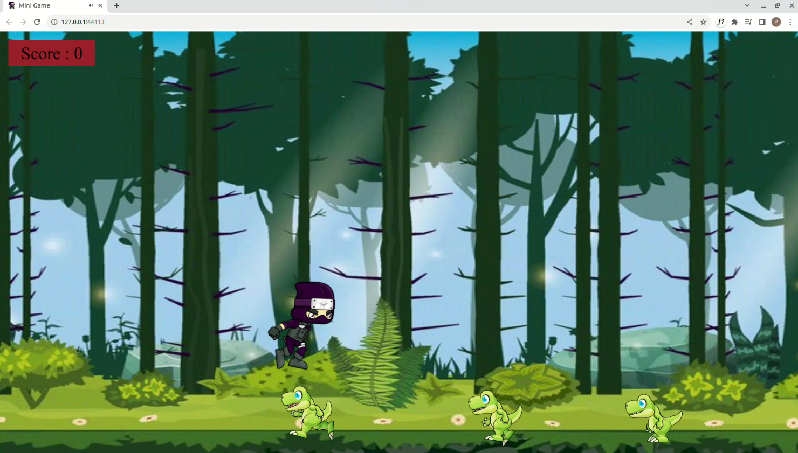
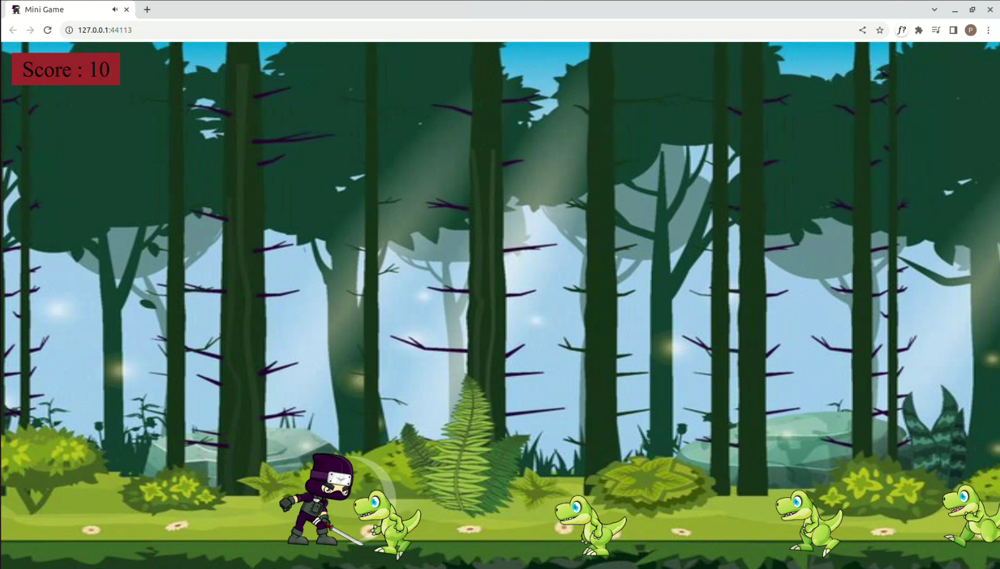
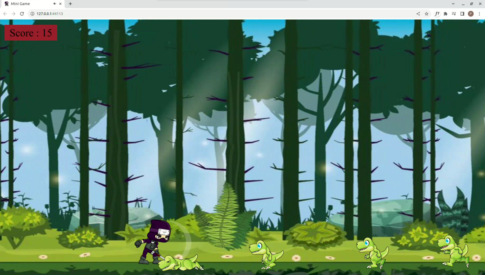
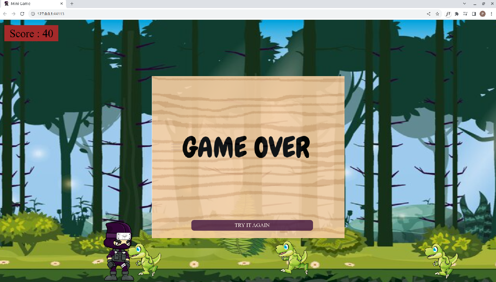

# Mini Game
Ninja vs. Dino is a simple mini game developed using HTML, CSS, and JavaScript. In this game, you control a ninja character and your goal is to defeat the attacking dinos while avoiding their attacks. You earn points for each defeated dino and must survive as long as possible to achieve a high score. If any dino manages to hit you, the game is over.

### How to Play
- Use the left arrow and right arrow keys to move the ninja character left and right.
- Press the spacebar to make the ninja character jump and avoid dino attacks.
- Click the left mouse button to make the ninja attack and defeat the dinos.
- Be careful not to get hit by any dino, as it will lead to a game over.

### Game Features
- Simple and intuitive controls.
- Real-time score tracking and display.
- Engaging gameplay with increasing difficulty as you progress.

### Aplication Preview   

   
   
   
   
   

### License
This is licensed under the [MIT license](LICENSE).